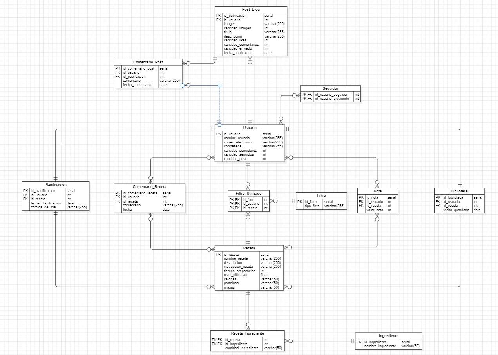

# HealthChef_Damian

## Titulo: HealthChef

### Objetivos 
Para que los usuarios puedan ver comida saludable, organizar con un calendario su plan de recetas para la semana o al mes y que puedan publicar sus recetas en un blog.

### Temática
App de recetas con recetas subidas o que suban y un blog para publicar  

### Modelo de datos

### Modelo de datos

### Como abrir el archivo mockup.fig
Ir al enlace de [figma](http://figma.com/) y loguearse. Cuando estés dentro, habrá un botón en la esquina superior derecha llamada IMPORT, le das al botón y podrás importar el mockup.fig
